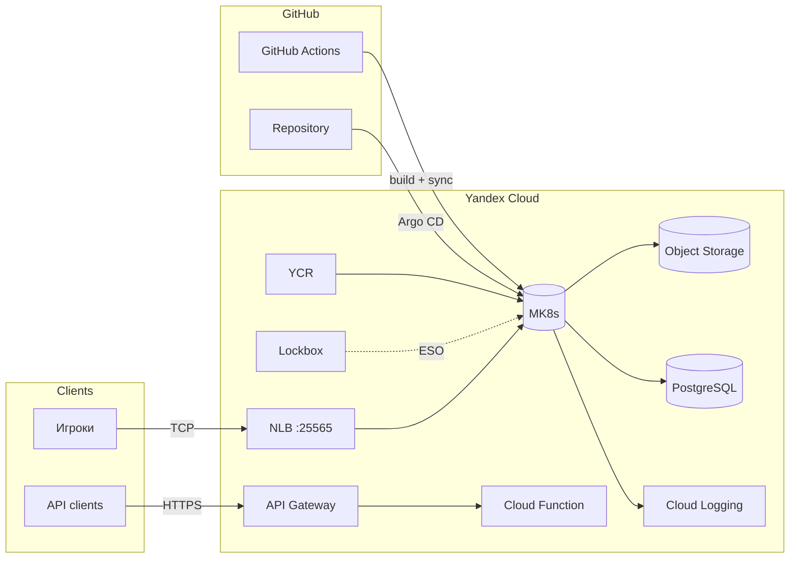
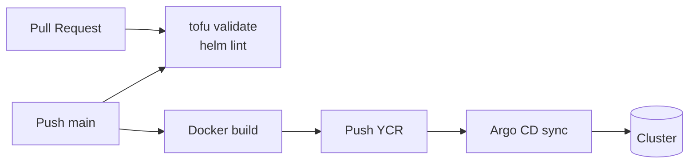
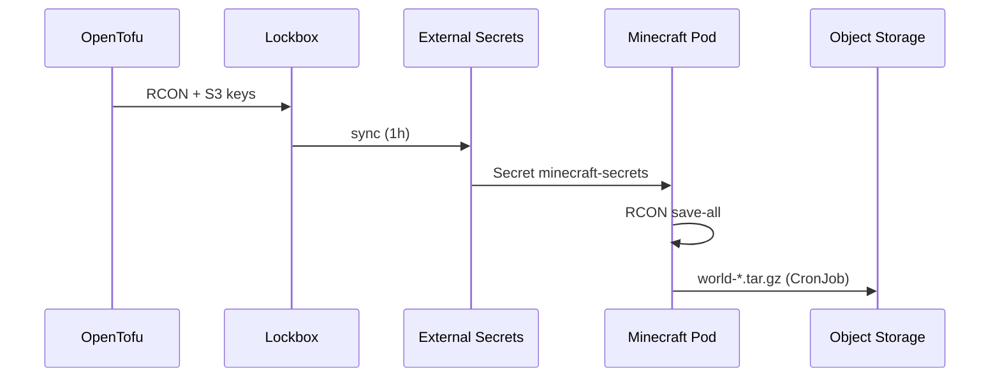

<div align="center">

# Minecraft on Yandex Cloud Kubernetes

**Production-grade DevOps lab:** один Minecraft-сервер (Paper), один общий мир, полный стек Yandex Cloud — от IaC до GitOps.

[](https://github.com/L3xu5/minecraft-yc-devops/actions/workflows/ci.yml)


[Быстрый старт](#-быстрый-старт) · [Архитектура](#-архитектура) · [GitOps](#-gitops) · [CI/CD](#-cicd) · [Операции](#-операции)

</div>

---

## 📋 О проекте

Pet-project для практики DevOps: развёртывание Java-сервера Minecraft в **Yandex Cloud Managed Kubernetes** с инфраструктурой как код, секретами в Lockbox, автобэкапами, observability и полным CI/CD-конвейером.

| Принцип | Реализация |
|---------|------------|
| Один мир | `replicas: 1`, `strategy: Recreate`, PVC `ReadWriteOnce` |
| Offline mode | `ONLINE_MODE=FALSE` — вход без лицензии Mojang |
| GitOps-first | Argo CD — единственный источник правды для деплоя |
| Secrets | Lockbox → External Secrets Operator, без секретов в git |
| Immutable infra | OpenTofu modules, Helm charts, GitHub Actions |

---

## 📑 Содержание

- [Стек технологий](#-стек-технологий)
- [Архитектура](#-архитектура)
- [Структура репозитория](#-структура-репозитория)
- [Требования](#-требования)
- [Быстрый старт](#-быстрый-старт)
- [Endpoints](#-endpoints)
- [GitOps](#-gitops)
- [CI/CD](#-cicd)
- [Бэкапы и DR](#-бэкапы-и-dr)
- [Observability](#-observability)
- [Terraform](#-terraform)
- [Операции](#-операции)
- [Безопасность](#-безопасность)
- [Troubleshooting](#-troubleshooting)
- [Стоимость и cleanup](#-стоимость-и-cleanup)

---

## 🛠 Стек технологий

<table>
<tr>
<td valign="top" width="50%">

### Infrastructure & Cloud

| Сервис | Назначение |
|--------|------------|
| **VPC + Security Groups** | Сеть, изоляция |
| **Managed Kubernetes** | Оркестрация, autoscaling 1–2 nodes |
| **Object Storage** | Бэкапы мира + Velero |
| **Container Registry** | Кастомный образ сервера |
| **Lockbox** | RCON, S3-ключи |
| **Cloud Logging** | Централизованные логи |
| **Managed PostgreSQL** | Метаданные / расширения |
| **Cloud Function** | HTTP status API |
| **API Gateway** | Публичный REST endpoint |

</td>
<td valign="top" width="50%">

### Platform & Delivery

| Сервис | Назначение |
|--------|------------|
| **Helm** | Minecraft chart + platform values |
| **Argo CD** | GitOps, app-of-apps |
| **External Secrets** | Sync Lockbox → K8s |
| **Fluent Bit** | Log shipper → YC Logging |
| **kube-prometheus-stack** | Metrics + Grafana |
| **Velero** | Cluster/namespace backup |
| **NetworkPolicy + PDB** | Сегментация и availability |
| **GitHub Actions** | Lint, build→YCR, Argo sync |

</td>
</tr>
</table>

<details>
<summary><strong>Опционально (при наличии домена)</strong></summary>

- **Cloud DNS** — A-record `mc.example.com`
- **Certificate Manager + ALB** — HTTPS для admin UI

Включение: `enable_dns = true` в `terraform.tfvars` → `./scripts/setup-dns.sh`

</details>

---

## 🏗 Архитектура

### High-level



### CI/CD pipeline



### Data flow: секреты и бэкапы



---

## 📁 Структура репозитория

```
.
├── terraform/
│   ├── modules/              # vpc, mk8s, storage, lockbox, logging, dns,
│   │                         # container-registry, velero, postgresql,
│   │                         # cloud-function, api-gateway
│   └── envs/dev/             # dev-окружение (tfvars — локально)
├── helm/
│   ├── minecraft/            # Chart: server, backup, watchdog, NetworkPolicy
│   └── platform/             # Prometheus, Velero values
├── argocd/applications/      # GitOps: app-of-apps
├── k8s/platform/             # Fluent Bit, ESO manifests, CI RBAC
├── docker/                   # Образ для YCR (FROM itzg/minecraft-server)
├── scripts/                  # Deploy & setup automation
├── config/                   # S3 lifecycle rules
├── docs/                     # monitoring.md
└── .github/workflows/        # CI/CD
```

---

## 📦 Требования

| Инструмент | Версия | Установка |
|------------|--------|-----------|
| [yc CLI](https://yandex.cloud/ru/docs/cli/quickstart) | latest | `curl … \| bash` |
| [OpenTofu](https://opentofu.org/) | ≥ 1.5 | `brew install opentofu` |
| [kubectl](https://kubernetes.io/docs/tasks/tools/) | ≥ 1.28 | `brew install kubectl` |
| [Helm](https://helm.sh/) | 3.x | `brew install helm` |
| Docker | optional | локальный push в YCR |

Аккаунт Yandex Cloud с правами на создание MK8s, Object Storage, Lockbox.

---

## 🚀 Быстрый старт

### 1. Yandex Cloud

```bash
yc init
yc config get folder-id
yc managed-kubernetes list-versions
```

### 2. Конфигурация Terraform

```bash
cd terraform/envs/dev
cp terraform.tfvars.example terraform.tfvars
# Заполни: folder_id, k8s_version, backup_bucket_name (глобально уникальное имя)
```

### 3. Полный деплой

```bash
./scripts/deploy-v2.sh
./scripts/deploy-velero.sh
kubectl apply -f argocd/applications/platform-root.yaml
```

<details>
<summary><strong>Пошаговый деплой</strong></summary>

```bash
./scripts/deploy-infra.sh       # VPC + MK8s + Lockbox + Storage + Registry + Logging
./scripts/deploy-platform.sh    # ESO + Lockbox sync + lifecycle
./scripts/deploy-minecraft.sh   # Helm chart + ожидание EXTERNAL-IP
./scripts/deploy-velero.sh      # Velero + S3 credentials
kubectl apply -f argocd/applications/platform-root.yaml
```

</details>

### 4. Подключение к серверу

```bash
export MC_HOST=$(kubectl get svc minecraft -n minecraft -o jsonpath='{.status.loadBalancer.ingress[0].ip}')
echo "Connect: ${MC_HOST}:25565"
```

---

## 🌐 Endpoints

| Сервис | URL / команда |
|--------|---------------|
| **Minecraft** | `kubectl get svc minecraft -n minecraft` → `EXTERNAL-IP:25565` |
| **API Gateway** | `tofu output -raw api_gateway_domain` |
| **Cloud Function** | `tofu output -raw cloud_function_url` |
| **PostgreSQL** | `tofu output -raw postgresql_host` |
| **Grafana** | `kubectl port-forward -n monitoring svc/kube-prometheus-grafana 3000:80` |
| **Argo CD** | `kubectl port-forward -n argocd svc/argocd-server 8080:443` |
| **Cloud Logging** | Консоль YC → Logging → `minecraft-k8s-logs` |

Пример проверки status API:

```bash
curl -s "https://$(tofu -chdir=terraform/envs/dev output -raw api_gateway_domain)/"
# {"service":"minecraft","host":"…","port":25565,"online":true}
```

---

## 🔄 GitOps

Argo CD управляет всеми компонентами через **app-of-apps**:

```
argocd/applications/
├── platform-root.yaml      # корневое Application
├── minecraft.yaml          # Helm chart сервера
├── external-secrets.yaml   # ESO operator
├── kube-prometheus.yaml    # Prometheus + Grafana
├── fluent-bit.yaml         # логи → Cloud Logging
└── velero.yaml             # cluster backup
```

```bash
kubectl apply -f argocd/applications/platform-root.yaml
kubectl get applications -n argocd
```

> **Важно:** GitHub Actions не деплоит Helm напрямую — только собирает образ и триггерит Argo sync.

---

## ⚙️ CI/CD

Workflow [`.github/workflows/ci.yml`](.github/workflows/ci.yml):

| Job | Триггер | Действие |
|-----|---------|----------|
| `validate` | PR + push | `tofu validate`, `helm lint` |
| `build-image` | push `main` | Docker build → push YCR |
| `sync-gitops` | push `main` | Argo CD sync всех Applications |

### Секреты GitHub

Settings → Secrets and variables → Actions:

| Secret | Описание |
|--------|----------|
| `YC_FOLDER_ID` | ID каталога Yandex Cloud |
| `YC_SA_JSON_CREDENTIALS` | JSON-ключ SA (долгоживущий, **не** IAM-токен) |

```bash
./scripts/setup-github-actions-sa.sh
gh secret set YC_SA_JSON_CREDENTIALS < key.json -R L3xu5/minecraft-yc-devops
gh secret set YC_FOLDER_ID -b "YOUR_FOLDER_ID" -R L3xu5/minecraft-yc-devops
kubectl apply -f k8s/platform/github-actions-rbac.yaml
```

---

## 💾 Бэкапы и DR

| Уровень | Механизм | Расписание | Хранилище |
|---------|----------|------------|-----------|
| **World** | CronJob: RCON `save-all` → tar → S3 | каждые 6 ч | `world-*.tar.gz` |
| **Cluster** | Velero namespace backup | 03:00 UTC | S3 prefix `velero/` |
| **Lifecycle** | STANDARD → COLD (7d) → DELETE (30d) | ежедневно 00:00 UTC | `./scripts/setup-lifecycle.sh` |

```bash
# Ручной бэкап мира
kubectl create job --from=cronjob/minecraft-world-backup backup-manual -n minecraft
kubectl logs -f job/backup-manual -n minecraft

# Список архивов
yc storage s3api list-objects-v2 --bucket minecraft-world-backup-b1gqbqg5
```

---

## 📊 Observability

| Компонент | Что даёт |
|-----------|----------|
| **Fluent Bit** | Логи pod'ов → Cloud Logging |
| **Prometheus** | Метрики кластера и приложений |
| **Grafana** | Дашборды (admin / `changeme-grafana`) |
| **Watchdog CronJob** | Каждые 15 мин: pod Ready + failed backups |

Подробнее: [docs/monitoring.md](docs/monitoring.md)

---

## 🏔 Terraform

### Modules

`vpc` · `mk8s` · `storage` · `lockbox` · `container-registry` · `logging` · `dns` · `velero` · `postgresql` · `cloud-function` · `api-gateway`

### Remote state (рекомендуется)

```bash
./scripts/setup-tfstate.sh
cp terraform/envs/dev/backend.tf.example terraform/envs/dev/backend.tf
cd terraform/envs/dev && tofu init -migrate-state
```

### Полезные outputs

```bash
cd terraform/envs/dev
tofu output -raw rcon_password          # RCON (sensitive)
tofu output -raw postgresql_host
tofu output -raw api_gateway_domain
tofu output -raw minecraft_image
```

---

## 🔧 Операции

<details>
<summary><strong>RCON-пароль</strong></summary>

```bash
cd terraform/envs/dev && tofu output -raw rcon_password
```

</details>

<details>
<summary><strong>Обновление образа вручную</strong></summary>

```bash
./scripts/build-push-image.sh
# Argo CD подхватит values-prod.yaml или сделай sync:
kubectl annotate application minecraft -n argocd argocd.argoproj.io/refresh=hard --overwrite
```

</details>

<details>
<summary><strong>DNS (если есть домен)</strong></summary>

```bash
./scripts/setup-dns.sh mydomain.ru.
# NS у регистратора → mc.mydomain.ru:25565
```

</details>

<details>
<summary><strong>Таблица скриптов</strong></summary>

| Скрипт | Назначение |
|--------|------------|
| `deploy-v2.sh` | Полный production deploy |
| `deploy-infra.sh` | Только Terraform + kubeconfig |
| `deploy-platform.sh` | ESO, Lockbox, lifecycle |
| `deploy-minecraft.sh` | Helm + EXTERNAL-IP |
| `deploy-velero.sh` | Velero + credentials |
| `setup-github-actions-sa.sh` | SA и ключ для CI |
| `setup-lifecycle.sh` | S3 lifecycle policy |
| `setup-tfstate.sh` | Bucket для remote state |
| `setup-dns.sh` | Cloud DNS |
| `build-push-image.sh` | Локальный push в YCR |

</details>

---

## 🔒 Безопасность

- Секреты только в **Lockbox** → ESO; `terraform.tfvars` и `*.tfstate` в `.gitignore`
- CI auth через **SA JSON** (`YC_SA_JSON_CREDENTIALS`), не short-lived IAM token
- **NetworkPolicy** ограничивает ingress/egress Minecraft pod
- **PodDisruptionBudget** `minAvailable: 1` для единственного pod
- GitHub Actions SA: минимальные роли + `ClusterRoleBinding` только для deploy

---

## 🩺 Troubleshooting

| Симптом | Решение |
|---------|---------|
| `Invalid session` в клиенте | Сервер в offline mode; проверь `minecraft.onlineMode: false` |
| EXTERNAL-IP `<pending>` | Квота NLB — освободи LoadBalancer или увеличь `ylb.networkLoadBalancers.count` |
| ESO webhook timeout | `./scripts/deploy-platform.sh` (`failurePolicy=Ignore`) |
| ExternalSecret не sync | `kubectl delete secret minecraft-secrets -n minecraft` |
| Backup `InvalidBucketName` | `./scripts/deploy-platform.sh` |
| CI `secrets is forbidden` | `kubectl apply -f k8s/platform/github-actions-rbac.yaml` |
| API Gateway `online: false` | Pod перезапускается; подожди 1–2 мин |
| Grafana/Argo без внешнего IP | Квота NLB → port-forward (см. [Endpoints](#-endpoints)) |

---

## 💰 Стоимость и cleanup

**Ориентир:** ~7 000–12 000 ₽/мес (MK8s + NLB + PostgreSQL + Storage + Lockbox + serverless).

```bash
cd terraform/envs/dev && tofu destroy
yc storage bucket delete --name minecraft-world-backup-b1gqbqg5
yc storage bucket delete --name minecraft-tfstate-b1gqbqg5  # если создавали
```

---

<div align="center">

**Minecraft** — торговая марка Mojang / Microsoft.  
Проект создан в учебных целях.

[⬆ Наверх](#minecraft-on-yandex-cloud-kubernetes)

</div>
