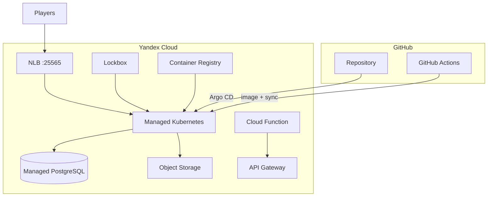

# Minecraft on Yandex Cloud Kubernetes

Production-grade DevOps lab: один Minecraft-сервер (Paper), полный стек Yandex Cloud и GitOps.

[](https://github.com/L3xu5/minecraft-yc-devops/actions/workflows/ci.yml)

---

## Стек технологий

| Категория | Реализовано |
|-----------|-------------|
| **IaC** | OpenTofu — VPC, MK8s (autoscaling 1–2 nodes), Lockbox, Object Storage, YCR, Cloud Logging |
| **Data** | Managed PostgreSQL, S3 backups + lifecycle, Velero cluster backups |
| **App** | Helm — Paper server, NetworkPolicy, PDB, offline mode |
| **Secrets** | Lockbox → External Secrets Operator |
| **Observability** | Fluent Bit → Cloud Logging, Prometheus, Grafana, watchdog CronJob |
| **Serverless** | Cloud Function (status API) + API Gateway |
| **GitOps** | Argo CD — app-of-apps (minecraft, ESO, Prometheus, Fluent Bit, Velero) |
| **CI/CD** | GitHub Actions — validate, build→YCR, Argo sync (SA JSON, без TTL-токенов) |
| **Optional** | Cloud DNS + Certificate Manager (при `enable_dns = true`) |

---

## Архитектура



---

## Быстрый старт

```bash
yc init
cd terraform/envs/dev && cp terraform.tfvars.example terraform.tfvars
./scripts/deploy-v2.sh          # полный деплой
./scripts/deploy-velero.sh      # Velero + credentials
kubectl apply -f argocd/applications/platform-root.yaml
```

**Подключение:** `kubectl get svc minecraft -n minecraft` → `EXTERNAL-IP:25565`

---

## Endpoints (после деплоя)

| Сервис | Как получить |
|--------|--------------|
| Minecraft | `81.26.186.86:25565` (или `kubectl get svc -n minecraft`) |
| API Gateway | `tofu output -raw api_gateway_domain` |
| Cloud Function | `tofu output -raw cloud_function_url` |
| PostgreSQL | `tofu output -raw postgresql_host` |
| Grafana | `kubectl port-forward -n monitoring svc/kube-prometheus-grafana 3000:80` |
| Argo CD | `kubectl port-forward -n argocd svc/argocd-server 8080:443` |

---

## CI/CD

Workflow: validate → **build image (YCR)** → **Argo CD sync** (без прямого Helm deploy).

Секреты: `YC_FOLDER_ID`, `YC_SA_JSON_CREDENTIALS` — см. `./scripts/setup-github-actions-sa.sh`

---

## GitOps (Argo CD)

```
argocd/applications/
├── platform-root.yaml      # app-of-apps
├── minecraft.yaml
├── external-secrets.yaml
├── kube-prometheus.yaml
├── fluent-bit.yaml
└── velero.yaml
```

---

## Бэкапы

| Тип | Расписание | Хранилище |
|-----|------------|-----------|
| World tar (RCON) | каждые 6 ч | S3 `world-*.tar.gz` |
| Velero (namespace) | 03:00 UTC | S3 prefix `velero/` |
| Lifecycle | 7d STANDARD → COLD → delete 30d | `./scripts/setup-lifecycle.sh` |

---

## Terraform modules

`vpc` · `mk8s` · `storage` · `lockbox` · `container-registry` · `logging` · `dns` · `velero` · `postgresql` · `cloud-function` · `api-gateway`

Remote state (опционально): `./scripts/setup-tfstate.sh`

---

## Скрипты

| Скрипт | Назначение |
|--------|------------|
| `deploy-v2.sh` | Полный production deploy |
| `deploy-velero.sh` | Velero + S3 credentials |
| `setup-github-actions-sa.sh` | SA для CI |
| `setup-lifecycle.sh` | S3 lifecycle policy |
| `setup-tfstate.sh` | Bucket для Terraform state |
| `setup-dns.sh` | Cloud DNS (если есть домен) |
| `build-push-image.sh` | Локальный push в YCR |

---

## Ограничения

- **DNS / TLS / ALB** — включи `enable_dns = true` и домен в `terraform.tfvars`
- **Grafana/Argo LB** — квота NLB (~2); Minecraft занимает 1 слот → port-forward для UI
- **Cloud Function status** — проверяет TCP с serverless-сети; может показывать `online: false` при рестарте pod

---

## Удаление

```bash
cd terraform/envs/dev && tofu destroy
```

---

## Стоимость

~7 000–12 000 ₽/мес с PostgreSQL и serverless (зависит от нагрузки).
