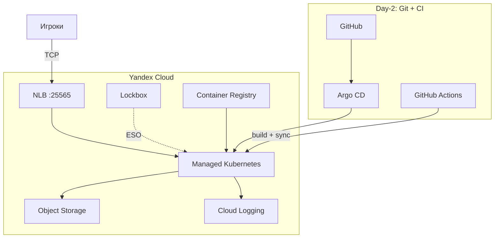
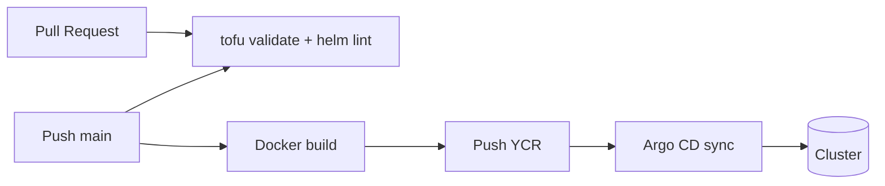

<div align="center">

# Minecraft on Yandex Cloud Kubernetes

Один Minecraft-сервер (Paper, offline mode) в **Managed Kubernetes** — DevOps-лаборатория: IaC, GitOps, секреты, бэкапы, observability. Каждая технология решает конкретную задачу.

[](https://github.com/L3xu5/minecraft-yc-devops/actions/workflows/ci.yml)


[Quick start](#quick-start) · [Architecture](#architecture) · [Best practices](#best-practices) · [Runbook](#runbook) · [Troubleshooting](#troubleshooting)

</div>

Репозиторий: [github.com/L3xu5/minecraft-yc-devops](https://github.com/L3xu5/minecraft-yc-devops)

---

## О проекте

| Принцип | Реализация |
|---------|------------|
| Один мир | `replicas: 1`, `strategy: Recreate`, PVC `ReadWriteOnce` |
| Offline mode | `ONLINE_MODE=FALSE` — вход без лицензии Mojang |
| GitOps-first | Argo CD — единственный источник правды для деплоя приложений |
| Secrets | Lockbox → External Secrets Operator, без секретов в git |
| Immutable delivery | CI → YCR; Argo CD синхронизирует манифесты из git |

### Что намеренно не включено

| Компонент | Причина |
|-----------|---------|
| Managed PostgreSQL | Не использовался приложением (~8 000 ₽/мес) |
| Cloud Function + API Gateway | Status API не нужен; health — K8s / Grafana |
| Публичные LB для Grafana/Argo | Экономия квоты NLB; доступ через `port-forward` |
| Custom domain | Подключение по IP NLB |

---

## Содержание

- [Стек](#стек)
- [Architecture](#architecture)
- [Структура репозитория](#структура-репозитория)
- [Требования](#требования)
- [Quick start](#quick-start)
- [Конфигурация Terraform](#конфигурация-terraform)
- [Endpoints](#endpoints)
- [GitOps](#gitops)
- [CI/CD](#cicd)
- [Бэкапы и DR](#бэкапы-и-dr)
- [Observability](#observability)
- [Best practices](#best-practices)
- [Security](#security)
- [Runbook](#runbook)
- [Troubleshooting](#troubleshooting)
- [Стоимость и cleanup](#стоимость-и-cleanup)

---

## Стек

| Слой | Компоненты |
|------|------------|
| **Cloud (YC)** | VPC, MK8s, Object Storage, YCR, Lockbox, Cloud Logging |
| **Platform** | ESO, Fluent Bit, Prometheus, Grafana, Velero, NetworkPolicy, PDB |
| **Delivery** | OpenTofu, Helm, Argo CD, GitHub Actions |
| **App** | Paper server, world backup CronJob, watchdog |

<details>
<summary>Опционально</summary>

- **Cloud DNS** — `enable_dns = true` + `./scripts/setup-dns.sh`
- **Remote Terraform state** — `./scripts/setup-tfstate.sh`
- **Node autoscaling 1–2** — включён; модуль `mk8s` всегда использует `auto_scale` (без replace при смене min/max)

</details>

---

## Architecture



### CI/CD pipeline



### Operational model

| Фаза | Кто меняет | Что |
|------|------------|-----|
| **Day 0** | OpenTofu | VPC, MK8s, Lockbox, Storage, YCR, logging SA |
| **Day 1** | Helm / scripts (bootstrap) | ESO, Fluent Bit, Prometheus, Velero, Argo CD |
| **Day 2** | Git + Argo CD | Minecraft chart, platform apps, образ из CI |

> После bootstrap **не** деплой Helm вручную — только через git и Argo CD sync.

---

## Структура репозитория

```
.
├── terraform/modules/       # vpc, mk8s, storage, lockbox, logging, dns, velero, container-registry
├── terraform/envs/dev/      # окружение (tfvars — локально)
├── helm/minecraft/          # server, backup, watchdog, NetworkPolicy, PDB
├── helm/platform/           # Prometheus, Velero values
├── argocd/applications/     # GitOps app-of-apps
├── k8s/platform/            # Fluent Bit, ESO, CI RBAC
├── docker/                  # образ для YCR
├── scripts/                 # bootstrap и runbook
└── .github/workflows/       # CI/CD
```

---

## Требования

| Инструмент | Версия | Назначение |
|------------|--------|------------|
| [yc CLI](https://yandex.cloud/ru/docs/cli/quickstart) | latest | YC API, kubeconfig |
| [OpenTofu](https://opentofu.org/) | ≥ 1.5 | IaC |
| [kubectl](https://kubernetes.io/docs/tasks/tools/) | ≥ 1.28 | Kubernetes |
| [Helm](https://helm.sh/) | 3.x | Bootstrap charts |
| Docker | optional | Локальный push в YCR |

Права в каталоге YC: MK8s, Object Storage, Lockbox, Container Registry, Logging.

---

## Quick start

### Day 0 — инфраструктура

```bash
yc init
yc config get folder-id
yc managed-kubernetes list-versions

cd terraform/envs/dev
cp terraform.tfvars.example terraform.tfvars
# folder_id, k8s_version, backup_bucket_name (глобально уникальное имя)

export YC_TOKEN=$(yc iam create-token)
tofu init && tofu apply
```

### Day 1 — platform bootstrap

```bash
./scripts/deploy-platform.sh      # ESO + Lockbox sync + S3 lifecycle
./scripts/deploy-minecraft.sh     # Helm chart + ожидание EXTERNAL-IP
./scripts/deploy-velero.sh       # Velero + credentials
kubectl apply -f argocd/applications/platform-root.yaml
```

<details>
<summary>Альтернатива: deploy-v2.sh (всё в одном скрипте)</summary>

```bash
./scripts/deploy-v2.sh
./scripts/deploy-velero.sh
kubectl apply -f argocd/applications/platform-root.yaml
```

</details>

### Day 2 — CI для GitHub

```bash
./scripts/setup-github-actions-sa.sh
gh secret set YC_SA_JSON_CREDENTIALS < key.json -R L3xu5/minecraft-yc-devops
gh secret set YC_FOLDER_ID -b "YOUR_FOLDER_ID" -R L3xu5/minecraft-yc-devops
kubectl apply -f k8s/platform/github-actions-rbac.yaml
```

### Проверка после деплоя

```bash
kubectl get nodes                          # STATUS Ready
kubectl get applications -n argocd         # Synced / Healthy
kubectl get pods -n minecraft              # minecraft-* Running
kubectl get svc minecraft -n minecraft     # EXTERNAL-IP:25565
kubectl get externalsecret -n minecraft    # SecretSynced
```

---

## Конфигурация Terraform

Файл: `terraform/envs/dev/terraform.tfvars` (не коммитится).

| Переменная | Default | Назначение |
|------------|---------|------------|
| `folder_id` | — | ID каталога YC |
| `k8s_version` | — | Версия K8s (`yc managed-kubernetes list-versions`) |
| `backup_bucket_name` | — | Глобально уникальное имя S3 bucket |
| `enable_backups` | `true` | Object Storage + SA для бэкапов |
| `enable_lockbox` | `true` | Lockbox + ESO SA |
| `enable_container_registry` | `true` | YCR |
| `enable_logging` | `true` | Log group + logging SA |
| `enable_velero` | `true` | Velero SA + S3 keys |
| `enable_dns` | `false` | Cloud DNS A-record |
| `enable_node_autoscaling` | `true` | min/max нод (1–2) |
| `node_preemptible` | `true` | Прерываемая worker VM (~70% дешевле; возможны простои) |
| `node_memory_gb` | `64` | Worker (max 4 vCPU); Minecraft heap 52G |
| `node_count` | `1` | Начальный размер node group |

Outputs:

```bash
cd terraform/envs/dev
tofu output -raw rcon_password       # sensitive
tofu output -raw minecraft_image
tofu output -raw backup_bucket_name
```

Remote state (рекомендуется):

```bash
./scripts/setup-tfstate.sh
cp terraform/envs/dev/backend.tf.example terraform/envs/dev/backend.tf
cd terraform/envs/dev && tofu init -migrate-state
```

---

## Endpoints

| Сервис | Доступ |
|--------|--------|
| **Minecraft** | `kubectl get svc minecraft -n minecraft` → `EXTERNAL-IP:25565` |
| **Grafana** | `kubectl port-forward -n monitoring svc/kube-prometheus-grafana 3000:80` → `admin` / `changeme-grafana` |
| **Argo CD** | `kubectl port-forward -n argocd svc/argocd-server 8080:443` |
| **Cloud Logging** | Консоль YC → Logging → `minecraft-k8s-logs` |

---

## GitOps

```
argocd/applications/
├── platform-root.yaml
├── minecraft.yaml
├── external-secrets.yaml
├── kube-prometheus.yaml
├── fluent-bit.yaml
└── velero.yaml
```

```bash
kubectl apply -f argocd/applications/platform-root.yaml
kubectl get applications -n argocd
```

Изменения в `helm/` или `argocd/` → commit → push `main` → CI sync → Argo CD применяет.

---

## CI/CD

[`.github/workflows/ci.yml`](.github/workflows/ci.yml):

| Job | Триггер | Действие |
|-----|---------|----------|
| `validate` | PR + push | `tofu validate`, `helm lint` |
| `build-image` | push `main` | Docker build → push YCR |
| `sync-gitops` | push `main` | Argo CD sync |

Секреты GitHub: `YC_FOLDER_ID`, `YC_SA_JSON_CREDENTIALS` (JSON-ключ SA, **не** IAM-токен).

---

## Бэкапы и DR

| Уровень | Механизм | Расписание |
|---------|----------|------------|
| **World** | CronJob: RCON `save-all` → tar → S3 | каждые 6 ч |
| **Cluster** | Velero namespace backup | 03:00 UTC |
| **Lifecycle** | STANDARD → COLD (7d) → DELETE (30d) | `./scripts/setup-lifecycle.sh` |

```bash
kubectl create job --from=cronjob/minecraft-world-backup backup-manual -n minecraft
yc storage s3api list-objects-v2 --bucket YOUR_BUCKET
```

---

## Observability

| Компонент | Назначение |
|-----------|------------|
| Fluent Bit | Логи pod'ов → Cloud Logging |
| Prometheus | Метрики кластера |
| Grafana | Дашборды |
| Watchdog CronJob | Pod Ready + failed backups (каждые 15 мин) |

Подробнее: [docs/monitoring.md](docs/monitoring.md)

---

## Best practices

### Инфраструктура

- **Не пересоздавай node group** без причины — каждая нода с `nat = true` запрашивает внешний IP.
- **Не запускай `tofu apply` в цикле** при quota error — лимит `vpc.externalAddressesCreation.rate` ~60 мин ([квоты YC](https://yandex.cloud/ru/docs/concepts/quotas-limits)).
- **Remote state** в S3 — не коммить `terraform.tfstate`.
- **Targeted apply** для node group: `./scripts/recover-node-group.sh` (не полный apply при восстановлении).
- **Bootstrap один раз**, дальше — git + Argo CD.

### Операции

- Бэкап мира перед обновлением chart или миграцией PVC.
- Обновление образа: push `main` или `./scripts/build-push-image.sh` + Argo sync.
- Grafana/Argo — `port-forward`, не LoadBalancer (квота NLB).

### Чего избегать

| Действие | Риск |
|----------|------|
| `tofu apply` каждые 5 мин при quota error | Retry VM, продление блокировки |
| LoadBalancer на Grafana + Argo + Minecraft | Исчерпание квоты NLB |
| Секреты в git / Helm values | Утечка RCON и S3 keys |
| Helm upgrade вручную после bootstrap | Расхождение с GitOps |

---

## Security

| Контроль | Реализация |
|----------|------------|
| Secrets | Lockbox → ESO; `terraform.tfvars` и state в `.gitignore` |
| CI auth | SA JSON (`YC_SA_JSON_CREDENTIALS`), не IAM token |
| Network | NetworkPolicy на Minecraft pod |
| Availability | PDB `minAvailable: 1` |
| RBAC | GitHub Actions SA — минимальные роли + отдельный ClusterRoleBinding |

RCON-пароль:

```bash
cd terraform/envs/dev && tofu output -raw rcon_password
```

---

## Runbook

### Восстановление node group (quota error)

Симптом в audit log:

```
RESOURCE_EXHAUSTED: Quota limit vpc.externalAddressesCreation.rate exceeded
```

```bash
# 1. Остановить retry
yc managed-kubernetes node-group list
yc managed-kubernetes node-group delete <NODE_GROUP_ID> --async

# 2. Подождать >= 60 мин с последней ошибки

# 3. Восстановить (интерактивно, один targeted apply)
./scripts/recover-node-group.sh

# 4. Проверить
kubectl get nodes
kubectl get pods -A
```

### Обновление образа

```bash
./scripts/build-push-image.sh
kubectl annotate application minecraft -n argocd argocd.argoproj.io/refresh=hard --overwrite
```

### Скрипты

| Скрипт | Назначение |
|--------|------------|
| `deploy-v2.sh` | Полный bootstrap (Terraform + platform + Helm) |
| `deploy-infra.sh` | Только Terraform + kubeconfig |
| `deploy-platform.sh` | ESO, Lockbox, lifecycle |
| `deploy-minecraft.sh` | Helm + EXTERNAL-IP |
| `deploy-velero.sh` | Velero + credentials |
| `recover-node-group.sh` | Восстановление после quota error |
| `setup-github-actions-sa.sh` | SA для CI |
| `setup-lifecycle.sh` | S3 lifecycle |
| `setup-tfstate.sh` | Remote state bucket |
| `setup-dns.sh` | Cloud DNS |
| `build-push-image.sh` | Локальный push в YCR |

---

## Troubleshooting

| Симптом | Решение |
|---------|---------|
| `externalAddressesCreation.rate exceeded` | [Runbook](#восстановление-node-group-quota-error). **Не** повторять apply |
| Много `Create instance` ошибок в audit log | Удали PROVISIONING node group → жди 60 мин → `recover-node-group.sh` |
| `kubectl get nodes` пуст | Node group не поднялась — runbook выше |
| Сервер offline, нода `NotReady` | Preemptible VM остановлена YC — подожди автозапуск (минуты) |
| EXTERNAL-IP `<pending>` | Квота NLB — освободи LB или увеличь `ylb.networkLoadBalancers.count` |
| `Invalid session` в клиенте | Offline mode: `minecraft.onlineMode: false` |
| ESO webhook timeout | `./scripts/deploy-platform.sh` |
| ExternalSecret не sync | `kubectl delete secret minecraft-secrets -n minecraft` |
| CI `secrets is forbidden` | `kubectl apply -f k8s/platform/github-actions-rbac.yaml` |
| Grafana/Argo без внешнего IP | `kubectl port-forward` — см. [Endpoints](#endpoints) |

---

## Стоимость и cleanup

| Компонент | ~₽/мес (24/7) |
|-----------|---------------|
| MK8s master | ~7 000 |
| Worker 4 vCPU / 64 GB (preemptible) | ~8 200 |
| NLB (Minecraft) | ~900 |
| Storage + Lockbox + Logging | ~1 500–2 000 |
| **Итого** | **~17 600–18 100** |

Minecraft: **52G** heap, pod **54Gi** (максимум на 64 GB worker с platform pods).

```bash
cd terraform/envs/dev && tofu destroy
yc storage bucket delete --name YOUR_BUCKET
```

---

<div align="center">

**Minecraft** — торговая марка Mojang / Microsoft. Проект создан в учебных целях.

</div>
