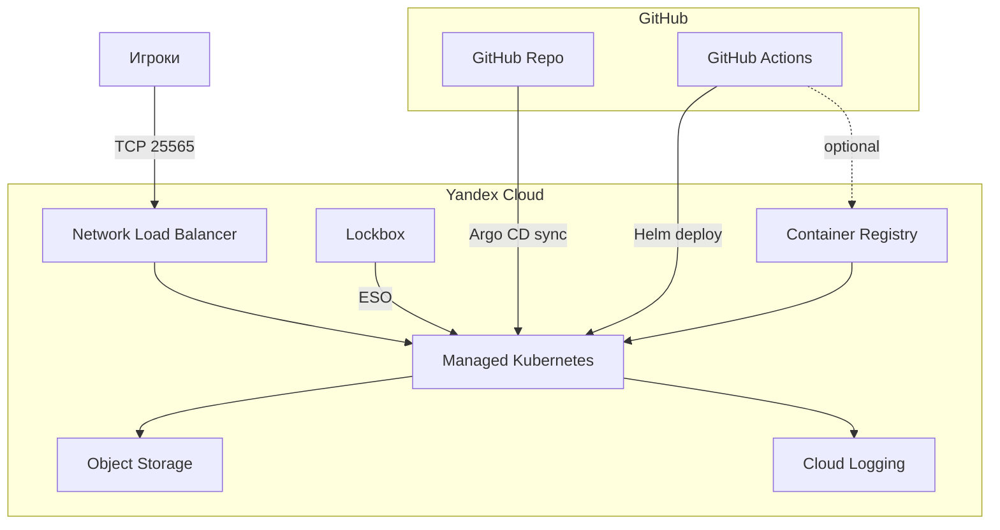

# Minecraft on Yandex Cloud Kubernetes

DevOps-проект: один Minecraft-сервер (Paper), один общий мир, инфраструктура как код на **Yandex Cloud Managed Kubernetes**.

[](https://github.com/L3xu5/minecraft-yc-devops/actions/workflows/ci.yml)

---

## Что внутри

| Слой | Технологии |
|------|------------|
| **Инфраструктура** | OpenTofu/Terraform — VPC, MK8s, Lockbox, Object Storage, Container Registry, Cloud Logging |
| **Приложение** | Helm chart `helm/minecraft/` — Paper, PVC, NLB, offline mode |
| **Секреты** | Yandex Lockbox + External Secrets Operator |
| **Бэкапы** | CronJob → RCON `save-all` → tar → S3 (lifecycle 7d → COLD → delete 30d) |
| **Наблюдаемость** | Fluent Bit → Cloud Logging, kube-prometheus-stack, watchdog CronJob |
| **GitOps** | Argo CD — sync из этого репозитория |
| **CI/CD** | GitHub Actions — validate на PR, Helm deploy на `main` |

---

## Архитектура



**Один мир = один pod:** `replicas: 1`, `strategy: Recreate`, PVC `ReadWriteOnce`.

---

## Структура репозитория

```
.
├── terraform/
│   ├── modules/          # vpc, mk8s, storage, lockbox, logging, dns, container-registry
│   └── envs/dev/         # dev-окружение (terraform.tfvars — локально, не в git)
├── helm/
│   ├── minecraft/        # Helm chart сервера, бэкапов, watchdog
│   └── platform/         # values для Prometheus, Fluent Bit
├── k8s/
│   ├── platform/         # ESO, Fluent Bit, RBAC для CI
│   └── apps/minecraft/   # legacy Kustomize (superseded by Helm)
├── argocd/applications/  # Argo CD Application
├── docker/               # кастомный образ для YCR
├── scripts/              # деплой и утилиты
├── config/               # lifecycle Object Storage
├── docs/                 # monitoring.md
└── .github/workflows/    # CI/CD
```

---

## Быстрый старт

### Требования

- [yc CLI](https://yandex.cloud/ru/docs/cli/quickstart)
- [OpenTofu](https://opentofu.org/) или Terraform ≥ 1.5
- [kubectl](https://kubernetes.io/docs/tasks/tools/)
- [Helm](https://helm.sh/) 3.x

### 1. Yandex Cloud

```bash
yc init
yc config get folder-id
yc managed-kubernetes list-versions
```

### 2. Конфиг Terraform

```bash
cd terraform/envs/dev
cp terraform.tfvars.example terraform.tfvars
# заполни folder_id, k8s_version, backup_bucket_name (глобально уникальное имя)
```

### 3. Полный деплой (рекомендуется)

```bash
./scripts/deploy-v2.sh
```

Скрипт поднимает: Terraform → Lockbox/ESO → Fluent Bit → Prometheus/Grafana → Helm (Minecraft) → Argo CD.

### 4. Пошаговый деплой

```bash
./scripts/deploy-infra.sh      # VPC + MK8s + Lockbox + Storage + Registry + Logging
./scripts/deploy-platform.sh   # External Secrets Operator + Lockbox sync
./scripts/deploy-minecraft.sh  # Helm chart
```

### 5. Подключение к серверу

```bash
kubectl get svc minecraft -n minecraft
# EXTERNAL-IP:25565
```

Сервер в **offline mode** (`ONLINE_MODE=FALSE`) — можно заходить без лицензии Mojang.

---

## Операции

### RCON-пароль

```bash
cd terraform/envs/dev && tofu output -raw rcon_password
```

### Ручной бэкап мира

```bash
kubectl create job --from=cronjob/minecraft-world-backup backup-manual -n minecraft
kubectl logs -f job/backup-manual -n minecraft
```

### Список бэкапов в Object Storage

```bash
yc storage s3api list-objects-v2 --bucket minecraft-world-backup-b1gqbqg5
```

### Grafana (port-forward)

Grafana по умолчанию ClusterIP (квота NLB). Доступ локально:

```bash
kubectl port-forward -n monitoring svc/kube-prometheus-grafana 3000:80
# http://localhost:3000  — admin / changeme-grafana
```

### Argo CD UI

```bash
kubectl port-forward -n argocd svc/argocd-server 8080:443
# https://localhost:8080
```

### Логи

Консоль YC → **Logging** → log group `minecraft-k8s-logs`, namespace `minecraft`.

Подробнее: [docs/monitoring.md](docs/monitoring.md)

---

## CI/CD (GitHub Actions)

Workflow [`.github/workflows/ci.yml`](.github/workflows/ci.yml):

| Триггер | Действие |
|---------|----------|
| Pull Request | `tofu validate`, `helm lint` |
| Push в `main` | Helm deploy в кластер `minecraft-k8s` |

### Секреты репозитория

Settings → Secrets and variables → Actions:

| Секрет | Описание |
|--------|----------|
| `YC_FOLDER_ID` | ID каталога Yandex Cloud |
| `YC_SA_JSON_CREDENTIALS` | JSON-ключ service account (долгоживущий, не IAM-токен) |

Настройка SA и секретов:

```bash
./scripts/setup-github-actions-sa.sh
gh secret set YC_SA_JSON_CREDENTIALS < /path/to/key.json -R L3xu5/minecraft-yc-devops
gh secret set YC_FOLDER_ID -b "YOUR_FOLDER_ID" -R L3xu5/minecraft-yc-devops
kubectl apply -f k8s/platform/github-actions-rbac.yaml
```

> Секрет `YC_TOKEN` (IAM-токен на 12 часов) **не нужен** — CI использует только SA JSON.

---

## GitOps (Argo CD)

Application описан в [`argocd/applications/minecraft.yaml`](argocd/applications/minecraft.yaml):

```bash
kubectl apply -f argocd/applications/minecraft.yaml
kubectl get application minecraft -n argocd
```

Argo CD синхронизирует Helm chart из `helm/minecraft/` с `values-prod.yaml` при изменениях в `main`.

---

## Кастомный образ (YCR)

```bash
./scripts/build-push-image.sh
```

Обнови `image.repository` в Helm или передай `--set` при деплое. Если Docker недоступен, используется fallback `itzg/minecraft-server`.

---

## Object Storage lifecycle

[`config/storage-lifecycle.json`](config/storage-lifecycle.json):

| Период | Класс хранения |
|--------|----------------|
| 0–7 дней | STANDARD |
| 7–30 дней | COLD |
| 30+ дней | DELETE |

```bash
./scripts/setup-lifecycle.sh
```

---

## Cloud DNS (опционально)

Если есть домен:

```bash
./scripts/setup-dns.sh mydomain.ru.
# NS у регистратора → mc.mydomain.ru:25565
```

В `terraform.tfvars`: `enable_dns = true`.

---

## Как сохраняется мир

- PVC `minecraft-data` — Yandex Disk 20 Gi SSD (`yc-network-ssd`)
- Helm: `persistence.existingClaim: minecraft-data` — мир переживает redeploy
- Автобэкап каждые 6 часов + watchdog каждые 15 минут

---

## Troubleshooting

| Проблема | Решение |
|----------|---------|
| `Invalid session` в клиенте | Сервер в offline mode; проверь `minecraft.onlineMode: false` |
| EXTERNAL-IP `<pending>` | Квота NLB — освободи LoadBalancer или увеличь `ylb.networkLoadBalancers.count` |
| ESO webhook timeout | `./scripts/deploy-platform.sh` (`failurePolicy=Ignore`) |
| ExternalSecret не sync | `kubectl delete secret minecraft-secrets -n minecraft` — ESO пересоздаст |
| Backup `InvalidBucketName` | `./scripts/deploy-platform.sh` — обновит ConfigMap |
| CI: `secrets is forbidden` | `kubectl apply -f k8s/platform/github-actions-rbac.yaml` |

---

## Стоимость (ориентир)

~5 000–9 000 ₽/мес — MK8s node, NLB, диск, Object Storage, Lockbox, логи.

Чтобы не платить простой:

```bash
cd terraform/envs/dev && tofu destroy
```

---

## Скрипты

| Скрипт | Назначение |
|--------|------------|
| `deploy-v2.sh` | Полный production-деплой |
| `deploy-infra.sh` | Только Terraform + kubeconfig |
| `deploy-platform.sh` | ESO, Lockbox, bucket ConfigMap |
| `deploy-minecraft.sh` | Helm chart + ожидание EXTERNAL-IP |
| `setup-github-actions-sa.sh` | SA и ключ для CI |
| `setup-lifecycle.sh` | Lifecycle policy бэкапов |
| `setup-dns.sh` | Cloud DNS A-record |
| `build-push-image.sh` | Сборка и push в YCR |

---

## Лицензия

Учебный / pet-project. Minecraft — торговая марка Mojang/Microsoft.
