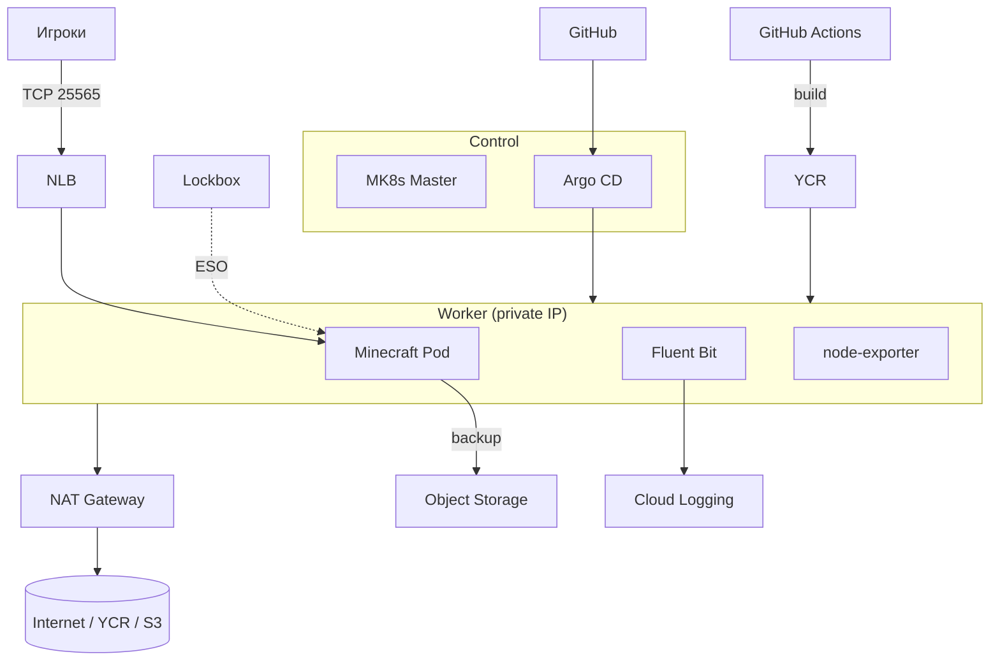
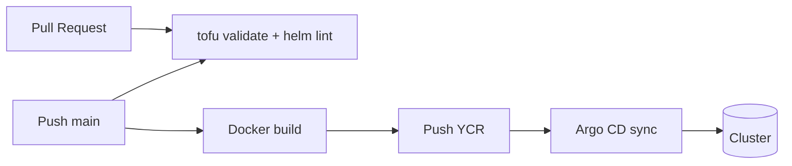

<div align="center">

# Minecraft on Yandex Cloud Kubernetes

Один Paper-сервер (offline mode) в **Managed Kubernetes** — DevOps-лаборатория с IaC, GitOps, секретами, бэкапами и observability. Каждая технология решает конкретную задачу, без «галочек ради галочек».

[](https://github.com/L3xu5/minecraft-yc-devops/actions/workflows/ci.yml)


[Быстрый старт](#быстрый-старт) · [Архитектура](#архитектура) · [GitOps](#gitops) · [Runbook](#runbook) · [Troubleshooting](#troubleshooting)

</div>

**Репозиторий:** [github.com/L3xu5/minecraft-yc-devops](https://github.com/L3xu5/minecraft-yc-devops)

---

## О проекте

Pet-project для практики DevOps: Java-сервер Minecraft в Yandex Cloud с полным циклом — от Terraform до CI/CD и GitOps.

| Принцип | Реализация |
|---------|------------|
| Один мир | `replicas: 1`, `strategy: Recreate`, PVC `ReadWriteOnce` |
| Offline mode | `ONLINE_MODE=FALSE` — вход без лицензии Mojang |
| GitOps-first | Argo CD — источник правды для приложений в кластере |
| Secrets | Lockbox → External Secrets Operator, без секретов в git |
| Immutable delivery | CI собирает образ → YCR; Argo CD синхронизирует манифесты |

### Production-профиль (текущий)

| Параметр | Значение |
|----------|----------|
| Worker | 4 vCPU, **64 GB**, **preemptible** |
| JVM heap | **52G** (максимум на allocatable ноды с platform pods) |
| Egress worker | **NAT-шлюз** (без public IP на каждой VM) |
| Публичный доступ | **1 NLB** → Minecraft `:25565` |
| Grafana / Argo CD | `ClusterIP` + `port-forward` |

### Что намеренно не включено

| Компонент | Причина |
|-----------|---------|
| Managed PostgreSQL | Не использовался (~8 000 ₽/мес) |
| Cloud Function + API Gateway | Status API не нужен для игры |
| NLB для Grafana / Argo | Квота NLB; admin UI через port-forward |
| Custom domain | Подключение по IP NLB (DNS — опционально) |

---

## Содержание

- [Стек](#стек)
- [Архитектура](#архитектура)
- [Структура репозитория](#структура-репозитория)
- [Требования](#требования)
- [Быстрый старт](#быстрый-старт)
- [Конфигурация](#конфигурация)
- [Endpoints](#endpoints)
- [GitOps](#gitops)
- [CI/CD](#cicd)
- [Бэкапы и DR](#бэкапы-и-dr)
- [Observability](#observability)
- [Best practices](#best-practices)
- [Security](#security)
- [Runbook](#runbook)
- [Troubleshooting](#troubleshooting)
- [Стоимость и cleanup](#стоимость-и-cleanup)

---

## Стек

| Слой | Технологии | Зачем |
|------|------------|-------|
| **Cloud** | VPC, NAT Gateway, MK8s, Object Storage, YCR, Lockbox, Cloud Logging | Сеть, compute, образы, секреты, логи |
| **Platform** | ESO, Fluent Bit, Prometheus, Grafana, Velero, NetworkPolicy, PDB | Секреты, observability, DR, безопасность |
| **Delivery** | OpenTofu, Helm, Argo CD, GitHub Actions | IaC, packaging, GitOps, CI |
| **App** | Paper, backup CronJob, watchdog | Игра, бэкапы мира, health-check |

<details>
<summary>Опционально</summary>

- **Cloud DNS** — `enable_dns = true` + `./scripts/setup-dns.sh`
- **Remote Terraform state** — `./scripts/setup-tfstate.sh`
- **Node autoscaling 1–2** — `enable_node_autoscaling`; модуль `mk8s` всегда использует `auto_scale` (без replace node group)

</details>

---

## Архитектура

### Сеть и трафик



### CI/CD



### Operational model

| Фаза | Инструмент | Что меняется |
|------|------------|--------------|
| **Day 0** | OpenTofu | VPC, NAT Gateway, MK8s, Lockbox, Storage, YCR, Velero SA |
| **Day 1** | Scripts / Helm (bootstrap) | ESO, Fluent Bit, Velero, Argo CD, первый sync |
| **Day 2** | Git + Argo CD + CI | Minecraft chart, platform values, образ из YCR |

После Day 1 изменения приложений — **только через git** (commit → push → Argo sync). Ручной `helm upgrade` конфликтует с Argo CD.

---

## Структура репозитория

```
.
├── terraform/
│   ├── modules/              # vpc (+ NAT), mk8s, storage, lockbox, logging, dns, velero, ycr
│   └── envs/dev/             # окружение (terraform.tfvars — локально, в .gitignore)
├── helm/
│   ├── minecraft/            # server, backup CronJob, watchdog, NetworkPolicy, PDB
│   └── platform/             # Prometheus, Velero values
├── argocd/applications/      # app-of-apps
├── k8s/platform/             # Fluent Bit, ESO manifests, CI RBAC
├── docker/                   # образ для YCR (FROM itzg/minecraft-server)
├── scripts/                  # bootstrap и runbook
├── config/                   # S3 lifecycle rules
├── docs/monitoring.md
└── .github/workflows/ci.yml
```

---

## Требования

| Инструмент | Версия |
|------------|--------|
| [yc CLI](https://yandex.cloud/ru/docs/cli/quickstart) | latest |
| [OpenTofu](https://opentofu.org/) | ≥ 1.5 |
| [kubectl](https://kubernetes.io/docs/tasks/tools/) | ≥ 1.28 |
| [Helm](https://helm.sh/) | 3.x |
| Docker | optional (локальный push в YCR) |
| [gh CLI](https://cli.github.com/) | optional (секреты CI) |

Права в каталоге YC: Managed Kubernetes, VPC, Object Storage, Lockbox, Container Registry, Logging.

---

## Быстрый старт

### 1. Yandex Cloud

```bash
yc init
yc config get folder-id
yc managed-kubernetes list-versions
yc managed-kubernetes cluster get-credentials --name minecraft-k8s --external --force
```

### 2. Day 0 — инфраструктура (OpenTofu)

```bash
cd terraform/envs/dev
cp terraform.tfvars.example terraform.tfvars
# Заполни: folder_id, k8s_version, backup_bucket_name (глобально уникальное)

export YC_TOKEN=$(yc iam create-token)
tofu init && tofu apply
```

### 3. Day 1 — platform bootstrap

```bash
./scripts/deploy-platform.sh
./scripts/deploy-velero.sh
kubectl apply -f argocd/applications/platform-root.yaml
```

<details>
<summary>Полный bootstrap одной командой (deploy-v2.sh)</summary>

```bash
./scripts/deploy-v2.sh
./scripts/deploy-velero.sh
kubectl apply -f argocd/applications/platform-root.yaml
```

</details>

### 4. Day 2 — CI (GitHub Actions)

```bash
./scripts/setup-github-actions-sa.sh
gh secret set YC_SA_JSON_CREDENTIALS < key.json -R L3xu5/minecraft-yc-devops
gh secret set YC_FOLDER_ID -b "YOUR_FOLDER_ID" -R L3xu5/minecraft-yc-devops
kubectl apply -f k8s/platform/github-actions-rbac.yaml
```

### 5. Проверка

```bash
kubectl get nodes                                    # Ready
kubectl get applications -n argocd                   # Synced / Healthy
kubectl get pods -n minecraft                        # Running
kubectl get svc minecraft -n minecraft               # EXTERNAL-IP:25565
kubectl get externalsecret -n minecraft              # SecretSynced
kubectl exec -n minecraft deploy/minecraft -- printenv MEMORY   # 52G
```

---

## Конфигурация

### Terraform (`terraform/envs/dev/terraform.tfvars`)

| Переменная | Default | Описание |
|------------|---------|----------|
| `folder_id` | — | ID каталога YC |
| `k8s_version` | — | `yc managed-kubernetes list-versions` |
| `backup_bucket_name` | — | Глобально уникальное имя S3 bucket |
| `enable_backups` | `true` | Object Storage + SA |
| `enable_lockbox` | `true` | Lockbox + ESO SA |
| `enable_container_registry` | `true` | YCR |
| `enable_logging` | `true` | Log group + logging SA |
| `enable_velero` | `true` | Velero SA + S3 keys |
| `enable_dns` | `false` | Cloud DNS A-record |
| `enable_node_autoscaling` | `true` | min=1, max=2 |
| `node_preemptible` | `true` | Прерываемая VM (~70% дешевле) |
| `node_memory_gb` | `64` | Max для 4 vCPU на standard-v3 |
| `node_count` | `1` | Начальный размер node group |

Outputs:

```bash
cd terraform/envs/dev
tofu output -raw rcon_password       # sensitive
tofu output -raw minecraft_image
tofu output -raw backup_bucket_name
```

Remote state (рекомендуется):

```bash
./scripts/setup-tfstate.sh
cp terraform/envs/dev/backend.tf.example terraform/envs/dev/backend.tf
cd terraform/envs/dev && tofu init -migrate-state
```

### Minecraft (`helm/minecraft/values-prod.yaml`)

| Параметр | Значение |
|----------|----------|
| `minecraft.memory` | `52G` |
| `resources.requests` | 3 CPU, 52Gi |
| `resources.limits` | 4 CPU, 54Gi |
| `minecraft.onlineMode` | `false` |
| `backup.schedule` | каждые 6 ч |

> **Почему 52G, а не 64G?** На 64 GB worker allocatable ~57 Gi; platform pods (Fluent Bit, node-exporter, kube-system) занимают часть. 52G heap — максимум без `Pending`.

---

## Endpoints

| Сервис | Доступ |
|--------|--------|
| **Minecraft** | `kubectl get svc minecraft -n minecraft` → `EXTERNAL-IP:25565` |
| **Grafana** | `kubectl port-forward -n monitoring svc/kube-prometheus-grafana 3000:80` → `admin` / `changeme-grafana` |
| **Argo CD** | `kubectl port-forward -n argocd svc/argocd-server 8080:443` |
| **Cloud Logging** | Консоль YC → Logging → `minecraft-k8s-logs` |

---

## GitOps

App-of-apps: `argocd/applications/platform-root.yaml`

| Application | Источник |
|-------------|----------|
| `minecraft` | `helm/minecraft` + `values-prod.yaml` |
| `external-secrets` | Helm chart ESO |
| `kube-prometheus` | kube-prometheus-stack + `helm/platform/prometheus-values.yaml` |
| `fluent-bit` | `k8s/platform/fluent-bit.yaml` |
| `velero` | Velero chart + `helm/platform/velero-values.yaml` |

```bash
kubectl apply -f argocd/applications/platform-root.yaml
kubectl get applications -n argocd
```

Workflow изменений:

1. Edit `helm/` или `argocd/`
2. `git commit && git push main`
3. CI: validate → build image → Argo sync
4. `kubectl get applications -n argocd`

---

## CI/CD

Workflow: [`.github/workflows/ci.yml`](.github/workflows/ci.yml)

| Job | Триггер | Действие |
|-----|---------|----------|
| `validate` | PR + push | `tofu validate`, `helm lint` |
| `build-image` | push `main` | Docker build → push YCR |
| `sync-gitops` | push `main` | Argo CD sync всех Applications |

Секреты GitHub (Settings → Actions):

| Secret | Описание |
|--------|----------|
| `YC_FOLDER_ID` | ID каталога YC |
| `YC_SA_JSON_CREDENTIALS` | JSON-ключ SA (**не** IAM-токен) |

---

## Бэкапы и DR

| Уровень | Механизм | Расписание | S3 prefix |
|---------|----------|------------|-----------|
| **World** | CronJob: RCON `save-all` → tar → S3 | `0 */6 * * *` | `world-*.tar.gz` |
| **Cluster** | Velero (namespace) | `0 3 * * *` UTC | `velero/` |
| **Lifecycle** | STANDARD → COLD (7d) → DELETE (30d) | `./scripts/setup-lifecycle.sh` | — |

```bash
# Ручной бэкап мира
kubectl create job --from=cronjob/minecraft-world-backup backup-manual-$(date +%s) -n minecraft
kubectl logs -f job/backup-manual-XXXX -n minecraft

# Список архивов
yc storage s3api list-objects-v2 --bucket YOUR_BUCKET --prefix world-
```

---

## Observability

| Компонент | Назначение |
|-----------|------------|
| **Fluent Bit** | Логи pod'ов → Cloud Logging |
| **Prometheus** | Метрики кластера и приложений |
| **Grafana** | Дашборды (ClusterIP) |
| **Watchdog CronJob** | Каждые 15 мин: pod Ready + failed backup jobs |

Подробнее: [docs/monitoring.md](docs/monitoring.md)

---

## Best practices

### Инфраструктура

- Worker **без public IP** — egress через NAT Gateway; не включай `nat = true` на нодах (rate-limit на IP).
- **Не пересоздавай node group** без причины — используй `./scripts/recover-node-group.sh`.
- **Не запускай `tofu apply` в цикле** при quota error — жди ~60 мин ([квоты YC](https://yandex.cloud/ru/docs/concepts/quotas-limits)).
- **Remote state** в S3 — не коммить `terraform.tfstate`.
- **Один NLB** — только Minecraft; Grafana/Argo через port-forward.

### GitOps

- После bootstrap — изменения **только через git**, не `helm upgrade` вручную.
- `values-prod.yaml` — prod-конфиг; секреты только через Lockbox/ESO.
- Push в `main` → CI sync → проверь `kubectl get applications -n argocd`.

### Preemptible worker

- YC может остановить VM → сервер offline на минуты; Instance Group поднимет ноду снова.
- Раз в ~24 ч — плановый перезапуск preemptible VM.
- Мир на PVC сохраняется.

### Чего избегать

| Действие | Риск |
|----------|------|
| `tofu apply` каждые 5 мин при quota error | Retry VM, продление блокировки |
| LoadBalancer на Grafana + Argo + Minecraft | Исчерпание квоты NLB |
| Секреты в git | Утечка RCON и S3 keys |
| Ручной helm после bootstrap | Drift с Argo CD |

---

## Security

| Контроль | Реализация |
|----------|------------|
| Secrets | Lockbox → ESO; `terraform.tfvars` и state в `.gitignore` |
| CI auth | SA JSON, не short-lived IAM token |
| Network | NetworkPolicy на Minecraft pod |
| Availability | PDB `minAvailable: 1` |
| RBAC | GitHub Actions SA + `k8s/platform/github-actions-rbac.yaml` |

RCON-пароль:

```bash
cd terraform/envs/dev && tofu output -raw rcon_password
```

---

## Runbook

### Восстановление node group

```bash
# Зависшая PROVISIONING group — удалить
yc managed-kubernetes node-group list
yc managed-kubernetes node-group delete <ID> --async

# После cooldown >= 60 мин
RECOVER_FORCE=1 ./scripts/recover-node-group.sh

kubectl get nodes
kubectl get pods -A
```

### Обновление образа

```bash
# Предпочтительно: push в main → CI
./scripts/build-push-image.sh   # или локально
kubectl annotate application minecraft -n argocd argocd.argoproj.io/refresh=hard --overwrite
```

### Preemptible: сервер offline

```bash
kubectl get nodes                    # NotReady → жди автозапуск IG
kubectl get pods -n minecraft        # Pending → нода ещё поднимается
```

### Скрипты

| Скрипт | Назначение |
|--------|------------|
| `deploy-v2.sh` | Полный bootstrap |
| `deploy-infra.sh` | Terraform + kubeconfig |
| `deploy-platform.sh` | ESO, Lockbox, S3 lifecycle |
| `deploy-minecraft.sh` | Helm (только bootstrap) |
| `deploy-velero.sh` | Velero credentials |
| `recover-node-group.sh` | Node group после quota error |
| `setup-github-actions-sa.sh` | SA для CI |
| `setup-lifecycle.sh` | S3 lifecycle |
| `setup-tfstate.sh` | Remote state bucket |
| `setup-dns.sh` | Cloud DNS |
| `build-push-image.sh` | Локальный push в YCR |

---

## Troubleshooting

| Симптом | Решение |
|---------|---------|
| `externalAddressesCreation.rate exceeded` | [Runbook](#восстановление-node-group). NAT Gateway уже в VPC — не включай `nat=true` на worker |
| Pod `Pending`: Insufficient memory/cpu | Уменьши `resources` в `values-prod.yaml` (см. allocatable: `kubectl describe node`) |
| `MEMORY=3G` в pod, ожидали 52G | Argo не синхронизирован — push git, `kubectl get applications -n argocd` |
| EXTERNAL-IP `<pending>` | Квота NLB — один LB на Minecraft, остальное port-forward |
| `Invalid session` в клиенте | Offline mode: `onlineMode: false` |
| ESO webhook timeout | `./scripts/deploy-platform.sh` |
| ExternalSecret не sync | `kubectl delete secret minecraft-secrets -n minecraft` |
| CI `secrets is forbidden` | `kubectl apply -f k8s/platform/github-actions-rbac.yaml` |
| Velero `upgrade-crds` ImagePullBackOff | В values: `upgradeCRDs: false`; удали job: `kubectl delete job velero-upgrade-crds -n velero` |
| Сервер offline, preemptible | Подожди 2–10 мин — IG перезапустит VM |

---

## Стоимость и cleanup

| Компонент | ~₽/мес (24/7) |
|-----------|---------------|
| MK8s master | ~7 000 |
| Worker 4 vCPU / 64 GB preemptible | ~8 200 |
| NLB (Minecraft) | ~900 |
| NAT Gateway + Storage + Lockbox + Logging | ~1 500–2 500 |
| **Итого** | **~17 600–18 600** |

```bash
cd terraform/envs/dev && tofu destroy
yc storage bucket delete --name YOUR_BUCKET
```

---

<div align="center">

**Minecraft** — торговая марка Mojang / Microsoft.  
Проект создан в учебных целях.

</div>
